# 車險行動批改 App 畫面流程（使用者視角）

> 給產品經理與新進開發者閱讀。本文件只描述「使用者會看到什麼畫面、按哪個按鈕會到哪裡」，不涉及程式結構。若需對應到原始碼類別，請展開每段結尾的「技術對應」區塊，對照 `docs/screen-flow.md`。

---

## 總覽圖

以下是整個 App 的主要畫面旅程。每個節點都是使用者實際會看到的畫面，不包含底層容器與彈出式輸入元件。

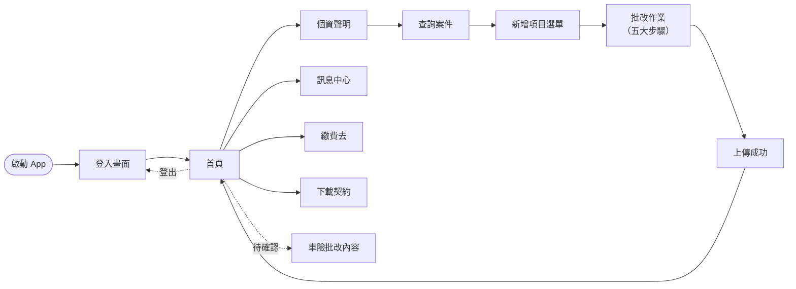

---

## 使用者旅程

### 1. 啟動與登入

- **旅程目標**：業務員以帳號密碼、快速登入權杖，或生物辨識（Face ID / Touch ID）完成身份驗證，進入 App 主畫面。
- **進入點**：點擊桌面 App Icon。

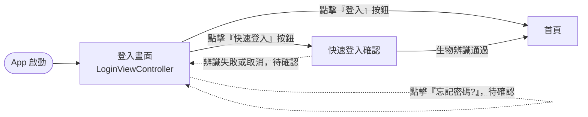

#### 畫面說明

- **登入畫面**：業務員輸入員編與密碼。畫面上提供「登入」、「快速登入」、「保費試算」三顆主按鈕；下方還有「忘記密碼?」連結、「記住我的帳號」與「更新難字資訊」兩個勾選框。成功登入後會自動同步版本資訊、預設資料並進入首頁。
- **快速登入確認**：若使用者曾啟用生物辨識，會跳出 Face ID / Touch ID 提示，驗證通過即直接進入首頁。

技術對應

| 畫面名稱 | 類別 | 檔案路徑 |
| --- | --- | --- |
| 登入畫面 | `LoginViewController` | `ViewController/登入/LoginViewController.swift` |
| 快速登入 | `CathayInsSSOHelper` | `CathayInsSSOHelper.swift` |

對應 `docs/screen-flow.md` 第 1 段（Communities 22 / 36 / 39 / 48）。

---

### 2. 首頁導覽

- **旅程目標**：讓業務員檢視自己的案件現況、訊息與佈告，並作為各主要功能的分流起點。
- **進入點**：登入成功後自動進入；批改完成後也會回到這裡。

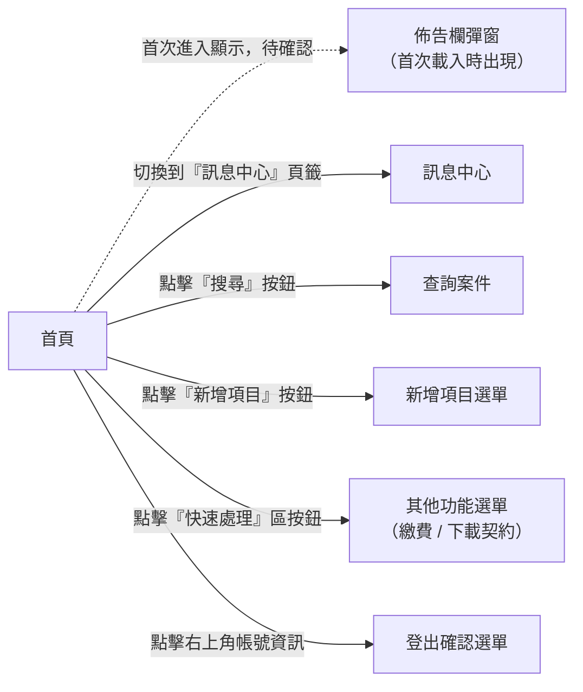

#### 畫面說明

- **首頁**：登入後的主畫面，上方顯示「車險行動批改」與業務員姓名，提供「新增項目」按鈕、「搜尋」按鈕與多個分頁（輸入中 / 已送審 / 速處理 / 待補全 / 保障分析 / 訊息中心）。每個分頁列出對應狀態的案件數量，點擊可切換內容。
- **佈告欄彈窗**：首次進入時顯示公司公告與推播通知，包含「新聞」、「推播」、「佈告欄」三個子頁。
- **訊息中心**：首頁內建的分頁之一，呈現未讀訊息數與系統通知。
- **其他功能選單**：點擊「快速處理」區塊會彈出選單，提供「繳費去」與「下載契約」兩個動作入口。
- **登出確認選單**：點擊右上角顯示「登出」與「下載預設資料」兩個選項；選擇登出會回到登入畫面。

#### 共用輸入元件

無（此旅程以導覽為主，不涉及輸入）。

技術對應

| 畫面名稱 | 類別 | 檔案路徑 |
| --- | --- | --- |
| 首頁 | `HomeViewController` | `ViewController/主畫面/HomeViewController.swift` |
| 佈告欄彈窗 | `HomePopupVC` | `ViewController/主畫面/訊息中心/HomePopupVC.swift` |
| 其他功能選單 | `ActionSheetVC` | `Utility/UI/客制化UI元件/ActionSheetVC.swift` |

對應 `docs/screen-flow.md` 第 1 段末與第 9 段（Community 48 / 19）。

---

### 3. 新增案件

- **旅程目標**：業務員選擇要批改的保單，並挑選要做哪一種批改（六選一），接著進入「批改作業」。
- **進入點**：首頁點擊「新增項目」按鈕。

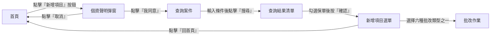

#### 畫面說明

- **個資聲明彈窗**：在進入查詢之前，要求使用者閱讀並同意客戶個資存取聲明，按下「我同意」才會繼續。
- **查詢案件**：左右分割畫面。左側輸入查詢條件（保單號、車號、被保人等），按下「搜尋」後右側顯示結果清單。右側列出符合條件的保單，可多選。
- **查詢結果清單**：右側的保單列表。每筆保單顯示狀態（可選 / 已確認 / 處理中 / 已送件等），使用者勾選後按「確認」進入下一步。
- **新增項目選單**：六個批改類型大按鈕—「基本資料變更」、「車籍資料變更」、「投保內容變更」、「保單過戶」、「保單退保」、「保單補發」。點擊其中一顆即決定後續「批改作業」要跑哪一組步驟內容。
- **批改作業**：進入五大步驟流程（見下方個別旅程）。

#### 共用輸入元件

| 元件 | 用途 | 出現在此旅程 |
| --- | --- | --- |
| 數字鍵盤 | 輸入員編、車號等 | 查詢案件 |
| 條碼掃描 | 掃描車牌或證號 | 查詢案件 |

技術對應

| 畫面名稱 | 類別 | 檔案路徑 |
| --- | --- | --- |
| 個資聲明彈窗 | `Personal_protectionVC` | `ViewController/共用/Personal_protectionVC.swift` |
| 查詢案件 | `SearchContractViewController` | `ViewController/主畫面/新增項目/查詢案件/SearchContractViewController.swift` |
| 查詢條件 | `SearchLeftViewController` | 同目錄 |
| 查詢結果 | `SearchRightViewController` | 同目錄 |
| 新增項目選單 | `NewContractViewController` | `ViewController/主畫面/新增項目/NewContractViewController.swift` |
| 批改作業 | `EditViewController` | `ViewController/主畫面/新增項目/EditViewController.swift` |

對應 `docs/screen-flow.md` 第 2 段（Communities 44 / 67）。

---

### 五大步驟總覽

第 1 步到第 5 步共用同一個「批改作業」外框，畫面上方的五大步驟頁籤貫穿全程；實際填寫的內容（尤其是第 1 步）會依照使用者在「新增項目選單」所選的六種案件類型而切換。每一步都會即時驗證使用者輸入，若目前步驟仍有欄位錯誤，系統不允許前往下一步。

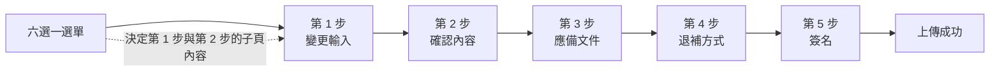

| 案件類型 | 第 1 步會出現的子頁 |
| --- | --- |
| 基本資料變更 | 被保人、要保人、第三人附加駕駛人名冊 |
| 車籍資料變更 | 車籍資料 |
| 投保內容變更 | 已保險種、加保險種、名冊、第三人附加駕駛人名冊 |
| 保單過戶 | 被保人(過戶)、要保人(過戶)、關係人、車籍資料(過戶)、第三人附加駕駛人名冊 |
| 保單退保 | 保單退保 |
| 保單補發 | 保單補發 |

---

### 4. 批改作業 ─ 第 1 步：變更輸入

- **旅程目標**：輸入或修改保戶、被保人、車籍、投保內容、過戶對象等資料。實際呈現哪些子頁依使用者在「新增項目選單」選的批改類型而定。
- **進入點**：從「新增項目選單」選定批改類型後進入。

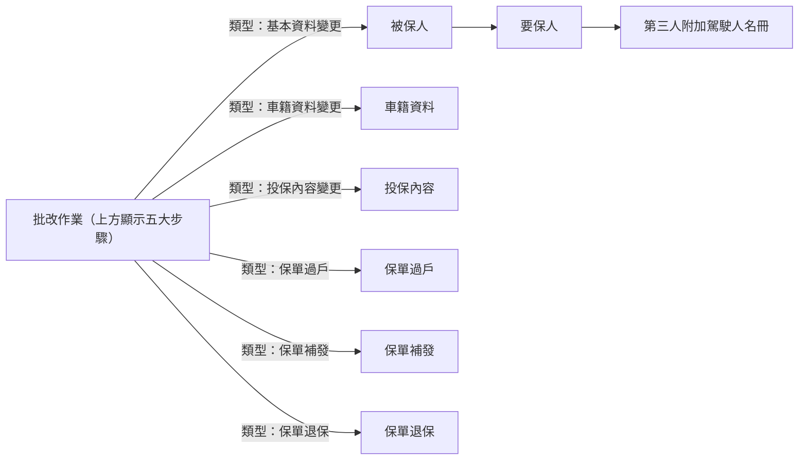

#### 畫面說明

- **批改作業（外框）**：畫面上方橫列五大步驟頁籤：變更輸入 / 應備文件 / 確認內容 / 簽名 / 退補方式。右上角有「回首頁」、「檢視」、「資料上傳」三顆按鈕。切換步驟前系統會檢查目前步驟的資料是否合法，沒填完不能前進。
- **被保人 / 要保人**：分別編輯「被保人」與「要保人」的姓名、身分證、生日、地址、電話等資料。畫面為條列式欄位卡片，欄位下方即時顯示驗證錯誤。
- **第三人附加駕駛人名冊**：一張可新增 / 移除駕駛人的表格，分「主要名冊」與「次要名冊」兩區。
- **車籍資料**：顯示車輛品牌、車型、排氣量、出廠年份等欄位，可透過選單挑選。
- **投保內容**：三個子頁—「已保險種」（現有險種清單）、「加保險種」（新增險種選單）、「名冊」（被保險人清單）。
- **保單過戶**：四個子頁—新被保人、新要保人、關係人、新車籍資料，每頁欄位與「基本資料變更」相似，但欄位會預填原保單資料供修改。
- **保單補發 / 保單退保**：各只有一個表單頁，填寫原因、補發方式或退保日期等。

#### 共用輸入元件

| 元件 | 用途 | 出現於 |
| --- | --- | --- |
| 數字鍵盤 | 身分證、電話、生日、排氣量等 | 所有人員與車籍表單 |
| 地址選擇 | 城市/區/路街 | 被保人、要保人、過戶人員表單 |
| 日期選擇 | 生日、出廠年份 | 被保人、要保人、車籍資料 |
| 下拉選單 | 車型、險種類別、關係、稱謂 | 投保內容、車籍資料、關係人 |
| 條碼掃描 | 車牌、身分證 | 車籍資料、被保人 |

技術對應

| 畫面名稱 | 類別 | 檔案路徑 |
| --- | --- | --- |
| 批改作業（外框） | `EditViewController` | `ViewController/主畫面/新增項目/EditViewController.swift` |
| 被保人 | `InsuredVC` | `ViewController/主畫面/五大步驟/變更輸入/...` |
| 要保人 | `PolicyHolderVC` | 同上 |
| 第三人附加駕駛人名冊 | `PGAddInsureTableVC` | 同上 |
| 車籍資料 | `CarInfoVC` | 同上 |
| 已保險種 | `InsuredCategoryVC` | 同上 |
| 加保險種 | `AdditionalInusranceCategoryVC` | 同上 |
| 名冊 | `InsuredContentRollVC` | 同上 |
| 被保人(過戶) | `InsuredTransferVC` | 同上 |
| 要保人(過戶) | `PolicyHolderTransferVC` | 同上 |
| 關係人 | `RelatedPersonVC` | 同上 |
| 車籍資料(過戶) | `CarInfoTransferVC` | 同上 |
| 保單補發 | `PGReissuePolicyViewController` | 同上 |
| 保單退保 | `CancelInsuranceVC` | 同上 |

對應 `docs/screen-flow.md` 第 3 段（Communities 2 / 4 / 12 / 29 / 30 / 32 / 33 / 34 / 37 / 50 / 51 / 58）。

---

### 5. 批改作業 ─ 第 2 步：確認內容

- **旅程目標**：向客戶出示新舊保單內容的差異與試算結果，確認沒有誤解後才繼續。
- **進入點**：在「批改作業」切換到「確認內容」頁籤。

#### 畫面說明

- **變更試算**：送出到後台重新計算新保費；完成後顯示核算結果。未完成試算前，使用者無法進行下一步。
- **變更前檢視**：以清單方式呈現原始保單的各項條件、險種、保額、保費。
- **變更後檢視**：以相同格式呈現變更後的保單內容，讓客戶一眼看出差異。
- **車險批改試算表**：展開詳盡的試算明細報表，供業務員與客戶討論（補發類案件才會看到）。

#### 共用輸入元件

此步驟為檢視畫面，不需使用者輸入。

技術對應

| 畫面名稱 | 類別 | 檔案路徑 |
| --- | --- | --- |
| 變更試算 | `ChangeTrialVC` | `ViewController/主畫面/五大步驟/確認內容/` |
| 變更前檢視 | `BeforeChangeVC` | 同目錄 |
| 變更後檢視 | `AfterChangeVC` | 同目錄 |
| 車險批改試算表 | `CarApplicationVC` | `.../建立批改申請書/` |

對應 `docs/screen-flow.md` 第 5 段（Communities 11 / 73 / 82 / 90）。

---

### 6. 批改作業 ─ 第 3 步：應備文件

- **旅程目標**：依照案件類型，檢視並補齊所有法定必備文件：上傳身分證、駕照等附件，填寫 KYC（認識客戶）、AC 適合度問卷、客戶同意書等聲明。
- **進入點**：在「批改作業」切換到「應備文件」頁籤。

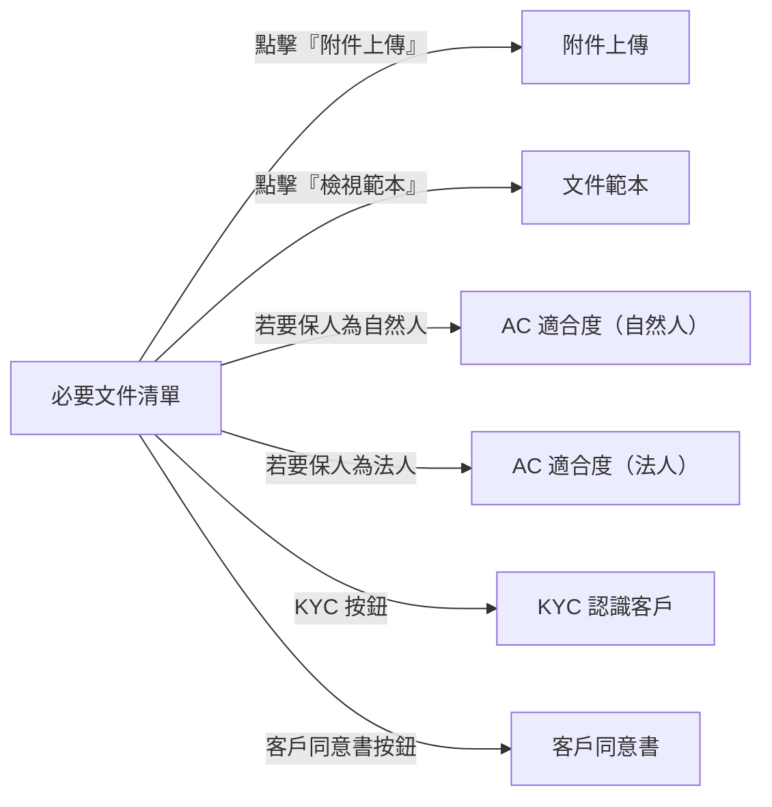

#### 畫面說明

- **必要文件清單**：以清單形式列出本案所需的每一份文件（例：雙證件正反面、委託書、保險證明等），每一列有「檢視範本」、「上傳附件」、或「簽署聲明」等動作按鈕。
- **附件上傳**：開啟系統相片庫或相機，讓使用者選取或拍照上傳對應文件的影像；可預覽、刪除已上傳影像。
- **文件範本**：顯示公司提供的範本圖示，讓使用者照著填寫。
- **AC 適合度（自然人 / 法人）**：保險合適度問卷，依要保人身分類別顯示不同題目。
- **KYC 認識客戶**：蒐集要保人的職業、收入、來源等資訊。
- **客戶同意書**：以文字與兩段驗證欄位要求客戶逐項確認並簽名同意。
- **退保／過戶聲明書**：特定案件類型（退保、過戶）會出現專屬的「保險退保申請聲明事項」或「保險過戶申請聲明事項」畫面。

#### 共用輸入元件

| 元件 | 用途 | 出現於 |
| --- | --- | --- |
| 相片選擇 | 上傳附件影像 | 附件上傳 |
| 數字鍵盤 | KYC 收入、金額 | KYC |
| 下拉選單 | KYC 職業、收入來源；AC 問卷 | KYC、AC 適合度 |
| 地址選擇 | AC 問卷、KYC 通訊地址 | AC 適合度、KYC |

技術對應

| 畫面名稱 | 類別 | 檔案路徑 |
| --- | --- | --- |
| 必要文件清單 | `PreparedDocumentVC` | `ViewController/主畫面/五大步驟/應備文件/PreparedDocumentVC.swift` |
| 附件上傳 | `PGAttachedImageVC` | 同目錄 |
| 文件範本 | `PGExampleDocContainerViewController` | `Storyboard/CathayShareTools.storyboard` |
| AC 適合度（自然人） | `ACListForHumanVC` | 同目錄 |
| AC 適合度（法人） | `ACListForLawManVC` | 同目錄 |
| KYC 認識客戶 | `KYCViewController` | 同目錄 |
| 客戶同意書 | `PGConsentViewController` | 同目錄 |
| 保險退保申請聲明事項 | `CancelInsuranceStatementViewController` | `.../退保聲明書/` |
| 保險過戶申請聲明事項 | `TransferInsuranceStatementViewController` | `.../過戶聲明書/` |

對應 `docs/screen-flow.md` 第 4 段（Communities 14 / 23 / 27）。

---

### 7. 批改作業 ─ 第 4 步：退補方式

- **旅程目標**：決定退費或補繳方式—信用卡、銀行帳戶、或寄送通知到 email—並填入必要的付款資訊。
- **進入點**：在「批改作業」切換到「退補方式」頁籤。

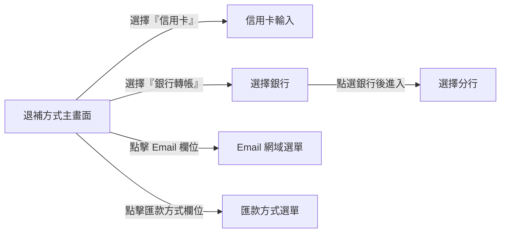

#### 畫面說明

- **退補方式主畫面**：依計算結果決定這張保單是要退費還是補繳，使用者從「信用卡」、「銀行轉帳」、「email 通知」等選項中選擇一種，並填寫關聯欄位。
- **信用卡輸入**：輸入卡號、持卡人姓名、到期日、安全碼等資訊。畫面包在獨立的導覽頁裡，有「取消」與「完成」按鈕。
- **選擇銀行 → 選擇分行**：兩層下拉式清單；先挑銀行，再挑該銀行的分行。回傳結果填入退補方式主畫面。
- **Email 網域選單 / 匯款方式選單**：以清單彈窗提供可選值，例如「@gmail.com」、「@cathay.com」或「匯款 / 轉帳」等。

#### 共用輸入元件

| 元件 | 用途 | 出現於 |
| --- | --- | --- |
| 數字鍵盤 | 卡號、帳號、金額 | 信用卡輸入、退補方式主畫面 |
| 下拉選單 | Email 網域、匯款方式、銀行 / 分行 | 退補方式主畫面、選擇銀行、選擇分行 |

技術對應

| 畫面名稱 | 類別 | 檔案路徑 |
| --- | --- | --- |
| 退補方式主畫面 | `RefundWayVC` | `ViewController/主畫面/五大步驟/退補方式/RefundWayVC.swift` |
| 信用卡輸入 | `CreditCardInputVC` | 同目錄 |
| 選擇銀行 | `BankVC` (nib `BankVC`) | 同目錄 |
| 選擇分行 | `BankBranchVC` | 同目錄 |
| Email 網域選單 / 匯款方式選單 | `PickerViewController` / `HardwordPickerViewController` | `ViewController/共用/` |

對應 `docs/screen-flow.md` 第 7 段（Communities 35 / 55）。

---

### 8. 批改作業 ─ 第 5 步：簽名

- **旅程目標**：蒐集本案每一位必要簽名人（要保人、被保人、法定代理人、第三人附加駕駛人、經手人或服務人員）的手寫簽名。
- **進入點**：在「批改作業」切換到「簽名」頁籤。

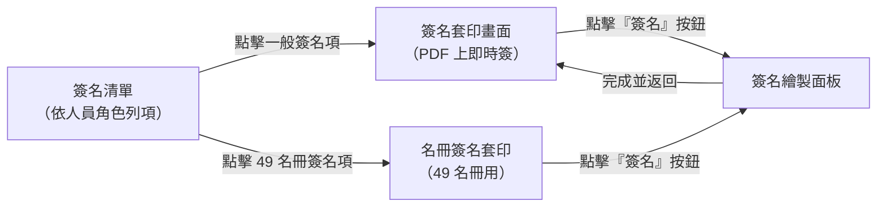

#### 畫面說明

- **簽名清單**：依目前案件動態生成必簽人員列—可能包含「要保人」、「被保人」、「法定代理人」、「第三人附加駕駛人（49）名冊」、「經手人」或「服務人員」。每一列顯示簽名狀態，可點擊進入簽名。
- **簽名套印畫面**：在實際保單 PDF 範本上，顯示需要簽名的位置框。點擊「簽名」按鈕即打開繪製面板。
- **名冊簽名套印**：專為「第三人附加駕駛人（49）名冊」設計，可一次顯示多位駕駛人與各自簽名格。
- **簽名繪製面板**：全畫面白色畫布，使用者以手指在畫布上書寫簽名，完成後儲存並回到套印畫面。

#### 共用輸入元件

無（完全由手寫簽名驅動）。

技術對應

| 畫面名稱 | 類別 | 檔案路徑 |
| --- | --- | --- |
| 簽名清單 | `SignatureListVC` | `ViewController/主畫面/五大步驟/簽名/主畫面/SignatureListVC.swift` |
| 簽名套印畫面 | `PGContentAddInPhotoVC` | `.../套印畫面/PGContentAddInPhotoVC.swift` |
| 名冊簽名套印 | `PGAddInsureContentAddInVC` | `.../套印畫面/` |
| 簽名繪製面板 | `SignatureVC` | `.../簽名頁/SignatureVC.swift` |

對應 `docs/screen-flow.md` 第 6 段（Communities 18 / 23 / 28）。

---

### 9. 上傳完成

- **旅程目標**：將五大步驟所有內容送出到伺服器，顯示成功訊息並回到首頁。
- **進入點**：在「批改作業」右上角點擊「資料上傳」。

#### 畫面說明

- **上傳成功**：全螢幕成功提示畫面，顯示本次批改已送件與案件編號。點擊「完成」後系統清除暫存的批改草稿並回到首頁。

技術對應

| 畫面名稱 | 類別 | 檔案路徑 |
| --- | --- | --- |
| 上傳成功 | `PGUploadCompleteVC` | `ViewController/主畫面/五大步驟/上傳成功/` |

對應 `docs/screen-flow.md` 第 8 段。

---

### 10. 繳費與下載契約

- **旅程目標**：讓使用者在 App 內完成保費繳交，或下載已定案的契約文件給客戶。
- **進入點**：首頁點擊「快速處理」區塊，再從彈出選單選擇「繳費去」或「下載契約」。

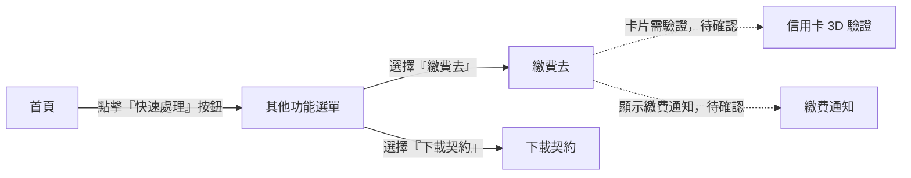

#### 畫面說明

- **繳費去**：App 內建的繳費流程；以全螢幕方式呈現，讓使用者輸入或確認信用卡資訊並送出扣款請求。
- **信用卡 3D 驗證**：若卡片需要 3D-Secure 驗證，跳出此畫面要求客戶輸入 OTP 或完成銀行 App 驗證。
- **繳費通知**：繳費送出後顯示的結果通知頁。
- **下載契約**：以全螢幕方式呈現，讓使用者選擇要下載的契約並存至 App 內或寄送給客戶。

#### 共用輸入元件

| 元件 | 用途 | 出現於 |
| --- | --- | --- |
| 數字鍵盤 | 輸入 OTP、金額 | 信用卡 3D 驗證 |

技術對應

| 畫面名稱 | 類別 | 檔案路徑 |
| --- | --- | --- |
| 繳費去 | `PGGoPayVC` | `ViewController/主畫面/其他功能/繳費/` |
| 信用卡 3D 驗證 | `D3DVerificationVC` | 同目錄 |
| 繳費通知 | `PaymentNoticeVC` | 同目錄 |
| 下載契約 | `PGDownloadContractVC` | `ViewController/主畫面/其他功能/下載契約/` |

對應 `docs/screen-flow.md` 第 9 段（Community 19）。

---

### 11. 訊息中心與佈告欄

- **旅程目標**：讓業務員閱讀公司發布的新聞、系統推播與佈告欄內容。
- **進入點**：首頁切換到「訊息中心」分頁，或於首頁首次載入時自動彈出佈告欄。

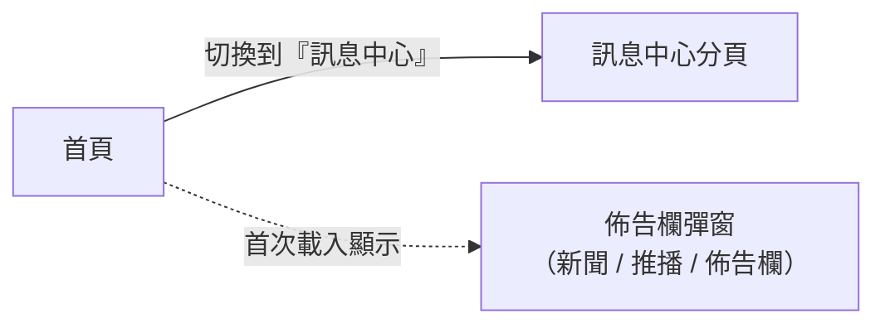

#### 畫面說明

- **訊息中心分頁**：顯示未讀訊息列表，每一則可點開閱讀全文。
- **佈告欄彈窗**：三個內部子頁—「新聞」、「推播」、「佈告欄」，分別呈現不同來源的重要公告。

技術對應

| 畫面名稱 | 類別 | 檔案路徑 |
| --- | --- | --- |
| 訊息中心分頁 | `HomeViewController`（內建 tab） | `ViewController/主畫面/HomeViewController.swift` |
| 佈告欄彈窗 | `HomePopupVC` | `ViewController/主畫面/訊息中心/HomePopupVC.swift` |

對應 `docs/screen-flow.md` 第 1 段末與第 9 段（Communities 48 / 19）。

---

### 12. 案件查詢與預覽

- **旅程目標**：業務員回頭查看已送出或進行中的批改案件內容。
- **進入點**：首頁切換到「輸入中 / 已送審 / 速處理 / 待補全 / 保障分析」等分頁，點選案件。

#### 畫面說明

- **車險批改內容**：以唯讀方式呈現此張保單的批改內容，包括變更前後差異與附件清單，供業務員檢閱或向客戶展示。

技術對應

| 畫面名稱 | 類別 | 檔案路徑 |
| --- | --- | --- |
| 車險批改內容 | `PreviewContractViewController` / `PreviewChangedContentVC` | `ViewController/主畫面/車險批改內容/` |

對應 `docs/screen-flow.md` 第 2 段末段「Needs verification」。

---

## 共用輸入元件

以下元件在多個畫面被重複使用，不屬於任一特定旅程。文件其他地方若提到「數字鍵盤」、「地址選擇」等，皆指此處定義的元件。

| 元件 | 用途 | 出現於哪些畫面 | 技術類別名稱 |
| --- | --- | --- | --- |
| 數字鍵盤 | 取代系統鍵盤，提供生日、電話、身分證、卡號、金額等純數字輸入 | 登入（帳號）、查詢案件、被保人、要保人、車籍資料、KYC、信用卡輸入、信用卡 3D 驗證 | `NumericPadViewController` |
| 地址選擇 | 城市 / 行政區 / 路街段三層選單，回傳完整地址 | 被保人、要保人、要保人(過戶)、被保人(過戶)、AC 適合度、KYC | `AddrFull`（搭配 `CSRAddress` 資料） |
| 日期選擇 | 以輪盤方式挑選日期，用於生日、出廠年份、保單起期等 | 被保人、要保人、車籍資料、退補方式 | `DatePickerVC` |
| 相片選擇 | 相機拍照或相簿多選，回傳照片至呼叫畫面 | 附件上傳（應備文件）、簽名套印附件 | `OpalImagePickerController`（封裝於 `PGAttachedImageVC`） |
| 條碼掃描 | 掃描車牌、身分證、條碼以自動填欄 | 車籍資料、被保人、查詢案件 | `PGBarcodeVC` |
| 下拉選單 | 以彈窗清單挑選固定選項（車型、險種、Email 網域、匯款方式、銀行等） | 車籍資料、投保內容、KYC、退補方式 | `PickerViewController` / `HardwordPickerViewController` / `CarBrandTypeVC` |

---

## 說明與查閱

- 「待確認」的虛線邊線代表該互動只在維基文件中提及、尚未在 `.swift` 中直接驗證。若你是工程師要接手某條流程，請先展開該旅程底部的「技術對應」並到 `docs/screen-flow.md` 查對應的 `file:line`。
- 所有畫面名稱以中文為主；Swift 類別名稱僅在首次出現與「技術對應」表中以英文標示。
- 若發現畫面名稱與 App 最新版本不一致，請以 `navigationItem.title` 或 storyboard 內的 `state title` 為準，並同步更新本文件。
