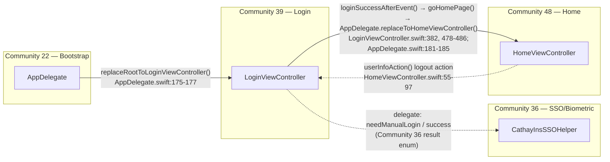
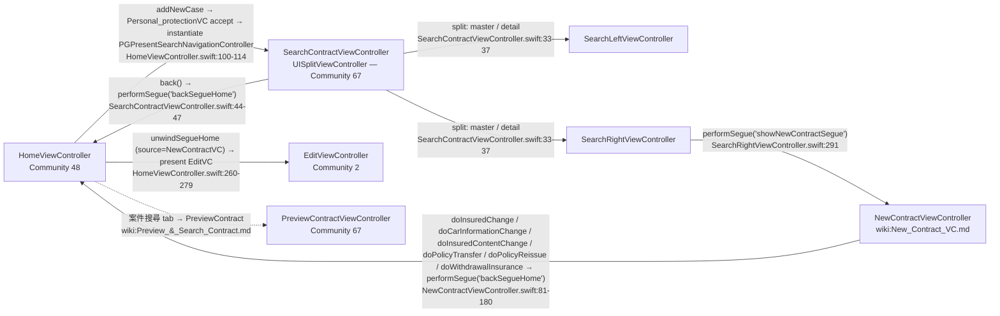
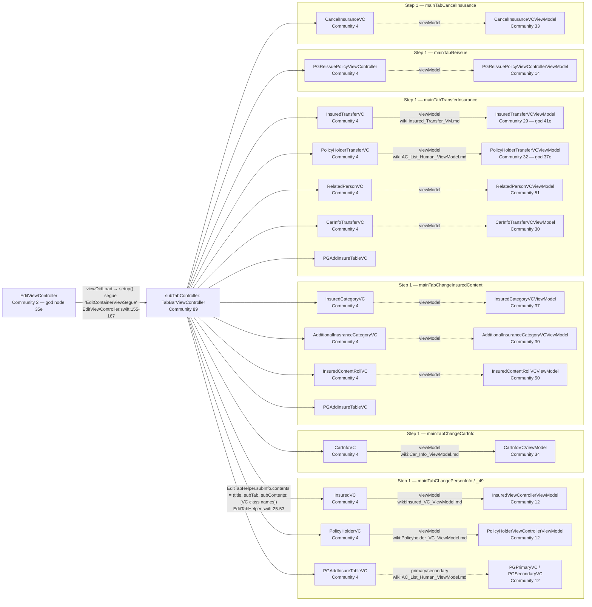
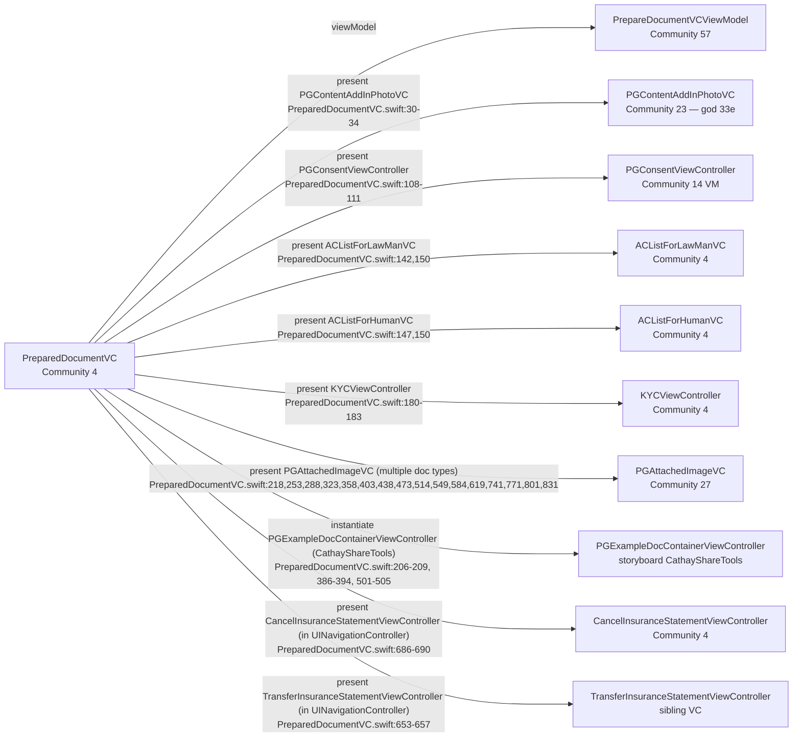
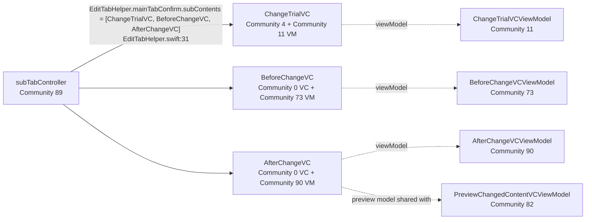
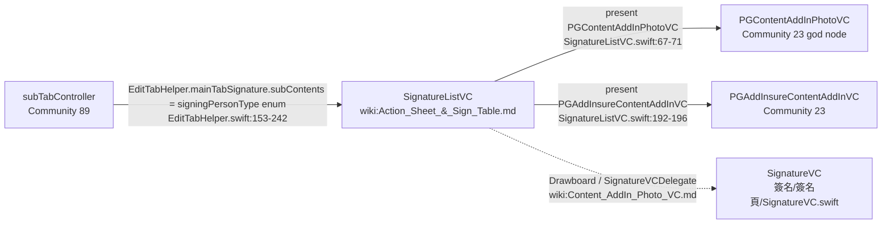
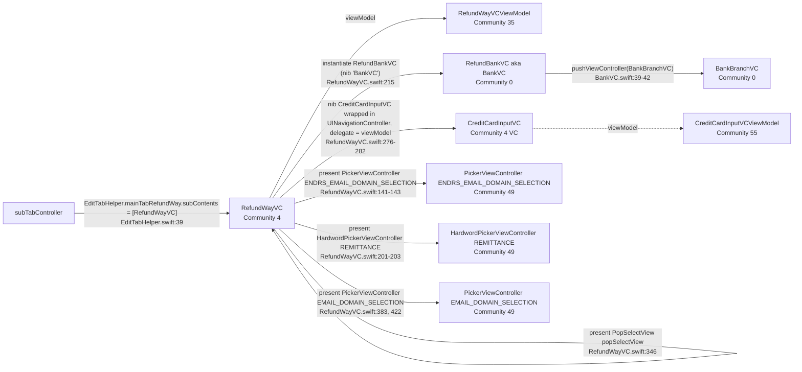
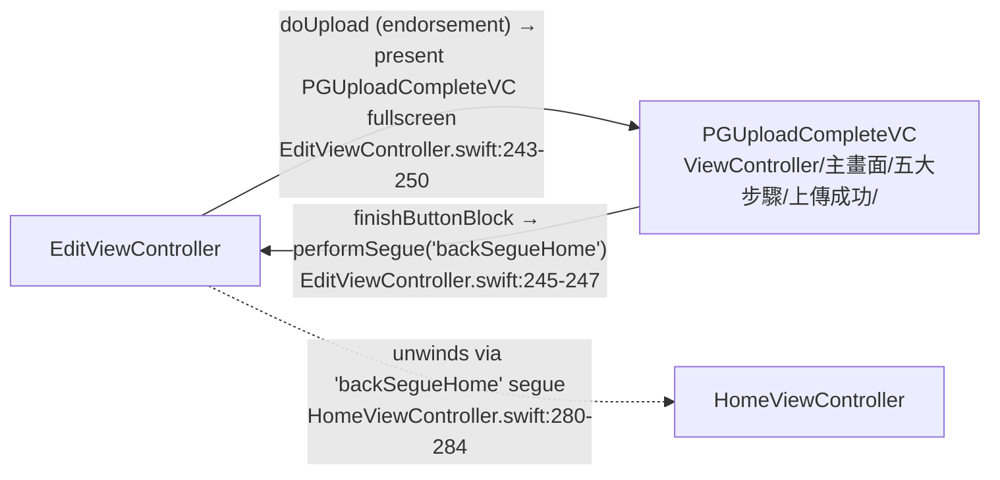
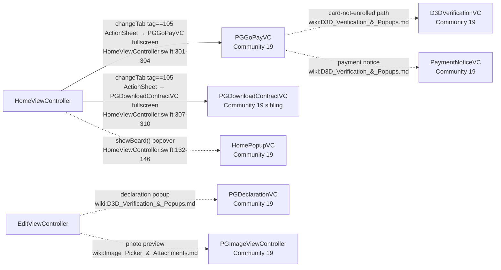
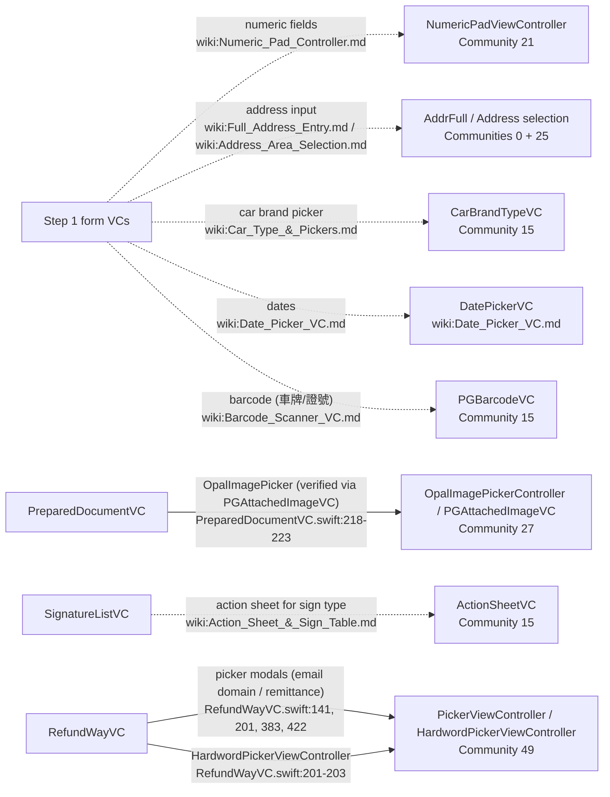

UnknownDiagramError: No diagram type detected matching given configuration for text: # Screen Flow — CathayInsCarCorrect

Companion to `docs/_map.md`. Diagrams are organized by the Leiden feature communities identified there.

## Edge convention

The graph.json edge vocabulary is **`calls, case_of, contains, imports, inherits, method`** — no `pushes_to / presents / navigation_link_to / performs_segue` variants exist (verified by enumerating `"relation":` values in graph.json). Every edge is `EXTRACTED` (no INFERRED/AMBIGUOUS).

Consequences:

- **Solid arrows** = trigger confirmed by reading the actual `.swift` file; each is cited as `file:line`.
- **Dashed arrows** = navigation asserted by a wiki entry (or clearly implied by the community structure) but with no navigation-typed graph edge to anchor it and no `.swift` verification. Every dashed edge appears in the community's *Needs verification* list.

The graph's `calls` / `contains` edges can corroborate that VC A instantiates class B, but that is not the same as "A navigates to B" — it could be a delegate, a helper, a model type. So even a `calls` edge is treated as dashed unless `.swift` confirms the trigger.

---

## 1. App Bootstrap & Login (Communities 22, 36, 39, 48)

Communities:
- **22** — `AppDelegate, UIWindow, CathayInsSSOHelperDelegate, CathaySDKSSOProxyDelegate, CathaySSODelegate` (`report:Community 22`).
- **36** — `BiometricCredentialResult (canceled/failed/needManualLogin/success), CathayInsSSOHelper, Keychain` (`report:Community 36`).
- **39** — `loginType (fastLogin/normalLogin/ssoLogin), LoginViewController` (`report:Community 39`).
- **48** — `HomeViewController`, single-node (`report:Community 48`).

### LoginViewController — Community 39
- **Purpose:** Agent login (normal ID/password, fast-login token, or SSO biometric); also refreshes AppVersion/HL check and default data on success. Source: `wiki:Login_View_Controller.md`, `wiki:Login_ViewModel.md`.
- **Inputs:** UITextField values via `PGRxTextField`, `PGRxHLTextField`, `PGPrevalidateTextField` (`wiki:Login_View_Controller.md`). Injected: `LoginViewControllerViewModel` — `wiki:Login_ViewModel.md`.
- **Exit points:**
  - `goHomePage(_:)` → `AppDelegate.replaceToHomeViewController(skipBoard:)` (LoginViewController.swift:478-486, AppDelegate.swift:181-185). Solid.
  - `loginSuccessAfterEvent()` gates the exit (LoginViewController.swift:382); inside it the VM promise chain runs `checkAPPVersion_promise`, `checkHL_promise`, `privacy_confirm`, `storeUserInfo`, `getDefaultData` (`wiki:Login_ViewModel.md`).
- **Linked subsystems:** `wiki:API_Request_Manager.md` (`PGAPIMannager`), `wiki:Realm_Default_Data.md` (`PGRealmManager(DefaultData)`), `wiki:SSO_Biometric_Helper.md`, `wiki:Keychain_Access.md`, `wiki:HLText_Downloader.md`, `wiki:User_Info_Singleton.md`. Relation types backing these: `calls`, `contains` (EXTRACTED).

### HomeViewController — Community 48
- **Purpose:** Tab root after login; contains 5 in-place child tabs (Inputting / Submitted / FastProcessing / GuaranteeAnalysis / MessageCenter) and hosts the unwind handler that launches the endorsement flow. `wiki:Home_View_Controller.md`.
- **Inputs:** `UserInfoObj.shared().AgentID` + `AgentName` (HomeViewController.swift:150, 171); `skip_showBoard` flag (HomeViewController.swift:183).
- **Exit points:**
  - `addNewCase(_:)` — presents `Personal_protectionVC` popover, then on accept instantiates `PGPresentSearchNavigationControllerViewController` (storyboard `HomeViewController`) wrapping `SearchContractViewController` (HomeViewController.swift:100-114). Solid.
  - `unwindSegueHome(_:)` with `segue.identifier == "backSegueHome"`:
    - source = `NewContractViewController` → instantiates `EditViewController` from storyboard `EditViewController`, sets `mainTabArray = source.tabArray`, presents fullscreen (HomeViewController.swift:260-279). Solid.
    - source = `EditViewController` → destroys `PGApplyData`, refreshes current child tab (HomeViewController.swift:280-284). Solid.
  - `changeTab` tag 105 → `ActionSheetVC` with [`PGGoPayVC`, `PGDownloadContractVC`] (HomeViewController.swift:294-318). Solid.
  - `userInfoAction()` → `ActionSheetVC` [logout / download default data] (HomeViewController.swift:55-97). Solid. Logout back to `LoginViewController` is dashed here because the branch calls out to `AppDelegate` / session teardown not re-read.
- **Linked subsystems:** `wiki:API_Request_Manager.md` (`PGQueryTabEndrsmntData`, `PGGetRecommendList`), `wiki:Message_Helper_Download.md` (`PGMessageHelper.sharedData().getAllUnreadCount()`), `wiki:Apply_Data_Upload.md` (`PGApplyData.destroy()` line 101, 282).

### AppDelegate — Community 22
- **Purpose:** Root controller swapping, env/SDK init, watermark, idle timeout. `wiki:App_Delegate_Lifecycle.md`, `wiki:AppDelegate.md`.
- **Inputs:** `CathayEnviroment.ENV_TYPE`, Firebase options, SDK credentials.
- **Exit points:** `replaceMainRootController(_:)` is the single choke point (AppDelegate.swift:166-172); callers: `replaceRootToLoginViewController` (:175), `replaceToHomeViewController(skipBoard:)` (:181).
- **Linked subsystems:** `wiki:Idle_UI_Application.md`, `wiki:Timeout_Checker.md`, `wiki:SSO_Biometric_Helper.md`, `wiki:Debug_Logging.md`, `wiki:Ptrace_Security.md`.

### Needs verification
- LoginVC ↔ CathayInsSSOHelper: the "success / needManualLogin" biometric branch is wiki-only (`wiki:SSO_Biometric_Helper.md`). No `.swift` trace captured in this pass.
- HomeVC → LoginVC logout path: the action closures from `userInfoAction()` call `AppDelegate` logout helpers; actual transition back to Login wasn't read.

---

## 2. Case Search & New-Contract (Communities 44, 67 and entry from 48)

- **44** — `SearchContractViewModel, SearchResultPolicy, processStatus (canSelect/confirmed/processing/remarked/submitted)` (`report:Community 44`).
- **67** — `PreviewContractViewController, SearchContractViewController, UISplitViewController` (`report:Community 67`).
- Entry VC `NewContractViewController` is referenced from `wiki:New_Contract_VC.md`; it has no Leiden community of its own.

### SearchContractViewController — Community 67
- **Purpose:** `UISplitViewController` shell that wraps the search filter (`SearchLeftViewController`) and results (`SearchRightViewController`). Source: `wiki:Preview_&_Search_Contract.md`.
- **Inputs:** `SearchContractViewModel.sharedData()` (singleton; `wiki:Search_Contract_VM.md`), injected into both master and detail (SearchContractViewController.swift:33-37).
- **Exit points:**
  - `back()` → `performSegue("backSegueHome")` unwinds to Home (SearchContractViewController.swift:44-47). Solid.
  - Detail VC's `showNewContractSegue` → `NewContractViewController` (SearchRightViewController.swift:291). Solid.
- **Linked subsystems:** `wiki:API_Request_Manager.md` (VM sends `PGQueryInsuredName` / similar), `wiki:Realm_Data_Entities.md` (Community 1 entities for search results).

### NewContractViewController — (no Leiden community)
- **Purpose:** Case-type picker (6 buttons mapping to the `processKind` code). `wiki:New_Contract_VC.md`.
- **Inputs:** `SearchContractViewModel.sharedData().getSelectedPolicyModel()` returning the selected policies (NewContractViewController.swift:83 etc).
- **Exit points (all via unwind):** Each IBAction sets `newCaseType` + `tabArray: [EditTabHelper.subInfo]` and calls `performSegue("backSegueHome")` — lines 81-180. The destination is `HomeViewController.unwindSegueHome` which presents `EditViewController` with the chosen `tabArray`.
  - `doInsuredChange` → `[mainTabChangePersonInfo, .mainTabConfirm, .mainTabAttached, .mainTabRefundWay, .mainTabSignature]` (NewContract…:89).
  - `doCarInformationChange` → `[mainTabChangeCarInfo, …]` (:106).
  - `doInsuredContentChange` → `[mainTabChangeInsuredContent, …]` (:123).
  - `doPolicyTransfer` → `[mainTabTransferInsurance, …]` (:140).
  - `doPolicyReissue` → `[mainTabReissue, .mainTabConfirmForReissue, …]` (:157).
  - `doWithdrawalInsurance` → `[mainTabCancelInsurance, …]` (:174).
  - `doBackAction` → `dismiss(animated:)` (:183-186).
- **Linked subsystems:** `wiki:Apply_Data_Observe.md`, `wiki:Apply_Data_Upload.md` (calls `PGApplyData.sharedData().fetchApplyData(processKind:)`), `wiki:Edit_Tab_Helper.md`.

### PreviewContractViewController — Community 67
- **Purpose:** Read-only case preview; surfaced from 案件搜尋 tab. `wiki:Preview_&_Search_Contract.md`.
- **Inputs / Exits:** WIKI-ONLY — not read in this pass.

### Needs verification
- Home → PreviewContractViewController trigger (dashed). The wiki groups them in Community 67 but the entry trigger wasn't read.
- SearchLeftViewController → SearchRightViewController interaction (the master/detail selection flow) — wiki-only.

---

## 3. Edit Shell + 五大步驟 Step 1: 變更輸入 (Communities 2, 4, 12, 29, 30, 32, 33, 34, 37, 42, 50, 51, 58)

The VC catalog is **Community 4** (39 nodes: `ACListForHumanVC, ACListForLawManVC, AdditionalInusranceCategoryVC, CancelInsuranceStatementViewController, CancelInsuranceVC, CarInfoTransferVC, CarInfoVC, …`). Their paired VMs live in Communities 12/29/30/32/33/34/37/50/51/55. `EditTabHelper.subInfo.contents` (EditTabHelper.swift:25-53) is the single source of truth for which VCs get placed under which main tab.

### EditViewController — Community 2
- **Purpose:** Main shell of the 5-step endorsement. Owns `editMainBar` (tab bar across top) + `subTabController: TabBarViewController` + upload button. Source: `wiki:EditViewController.md`, EditViewController.swift:19-177.
- **Inputs:** `mainTabArray: [EditTabHelper.subInfo]` (set by `HomeViewController.unwindSegueHome`, HomeViewController.swift:271), `PGApplyData.sharedData()` (the shared draft — `wiki:Apply_Data_Observe.md`).
- **Exit points:**
  - `backButtonPressed` — if no `DTABJ998` data, sends `PGDeleteRequest` then `performSegue("backSegueHome")` (EditViewController.swift:75-79). Else shows confirm alert → either `doSaveTemp()` + unwind (EditViewController.swift:87-92) or immediate unwind (EditViewController.swift:96, 103). Solid.
  - `doUpload` — endorsement path presents `PGUploadCompleteVC` (fullscreen) whose `finishButtonBlock` unwinds with `backSegueHome` (EditViewController.swift:241-251). saveTemp path stays in place. Solid.
  - Debug path: tap `title_lbl` → present `PGSPNavVC` (debug Realm viewer, storyboard `PGSPVC`) (EditViewController.swift:140-142). Solid.
  - `prepare(for:sender:)` — `EditContainerViewSegue` wires `subTabController = segue.destination as? TabBarViewController` (EditViewController.swift:159-160). Solid embed.
- **Linked subsystems:** `wiki:Edit_Tab_Helper.md` (Community 42), `wiki:Apply_Data_Upload.md` (`PGApplyData.doSaveOrEndorsement(_:)` line 241), `wiki:API_Request_Manager.md` (`PGDeleteRequest` / `DoDelete`), `wiki:Alert_Controller.md`, `wiki:Activity_HUD.md`, `wiki:Realm_Core_Manager.md`. Confirmed via `.swift` reads.

### InsuredVC / PolicyHolderVC / PGAddInsureTableVC — Community 4
- **Purpose:** 被保人 / 要保人 data-edit panels inside Step 1. `wiki:AC_List_Human_VC.md` lists source paths. PGAddInsureTableVC hosts the 49-named-list (第三人附加駕駛人傷害險) as a table with Primary/Secondary cells.
- **Inputs:** `viewModel` conforming to `PGBaseViewControllerViewModelProtocol` — assigned by the parent TabBarViewController's child-VC instantiation (pattern repeated across Step 1 VCs — `wiki:AC_List_Human_ViewModel.md`). `PGApplyData.sharedData()` read.
- **Exit points:** No direct navigation. They bubble validity via `.getErrorCount()` on the VM (`wiki:Insured_VC_ViewModel.md`). EditViewController reads `badgeArray` (EditViewController.swift:214) and `checkIfIsValidToSwitch(fromTab:toTab:)` (EditViewController.swift:290) to gate swipe to the next main tab. This is the primary output channel, not a push/present.
- **Linked subsystems:** `wiki:Realm_Data_Entities.md` (Community 1 `*_RLM` entities), `wiki:Validation_Rules.md`, `wiki:AddInsure_Validation.md`, `wiki:Regex_Components.md`, `wiki:Full_Address_Entry.md` (`AddrFull`), `wiki:Rx_Custom_Operators.md`.

### CarInfoVC / CarInfoTransferVC — Communities 4 + 30/34
- **Purpose:** Car data edit; both versions share cell catalog `wiki:Car_Info_Cell_ViewModels.md` and use `wiki:Car_Type_&_Pickers.md`.
- **Inputs:** `CarInfoVCViewModel` / `CarInfoTransferVCViewModel`; `carTypeSelectionDelegate, carSelectionDelegate` (Community 34 + 30).
- **Exit points:** VM delegates `didSelectCarType()` etc. No push; tap on car-type cell presents `CarBrandTypeVC` (Community 15) — WIKI-ONLY per `wiki:Car_Type_&_Pickers.md`; not verified in this pass.
- **Linked subsystems:** same as InsuredVC plus `wiki:Numeric_Pad_Controller.md` for numeric-entry fields.

### InsuredTransferVC / PolicyHolderTransferVC / RelatedPersonVC / PGAddInsureTableVC — Communities 4 + 29/32/51
- **Purpose:** 保單過戶 (ownership transfer) sub-step; three people-edit panels plus the 49 table. `wiki:AC_List_Human_VC.md`.
- **Inputs:** Matching VMs (God nodes for Insured/PolicyHolder transfer). `loadCustomerData()` method on `InsuredTransferVCViewModel` (`wiki:Insured_Transfer_VM.md`) suggests it can pre-populate from server.
- **Exit points:** Same badge/error-count output as above. EditViewController gates the `mainTabTransferInsurance` → `mainTabConfirm` swipe (EditViewController.swift:202-211).
- **Linked subsystems:** same; additionally `wiki:API_Request_Manager.md` for `loadCustomerData`.

### PGPrimaryVC / PGSecondaryVC — Community 12
- **Purpose:** Two-section list inside 名冊 (49); primary = the main insured contract holders, secondary = additional drivers (per `wiki:AC_List_Human_ViewModel.md`).
- **Inputs / Exit points:** WIKI-ONLY. Not read in `.swift` this pass.
- **Linked subsystems:** `wiki:AddInsure_Validation.md`, `wiki:Full_Address_Entry.md`.

### InsuredCategoryVC / AdditionalInusranceCategoryVC / InsuredContentRollVC — Communities 4 + 37/30/50
- **Purpose:** 投保內容變更 tabs (已保險種 / 加保險種 / 名冊). `wiki:AC_List_Human_VC.md`.
- **Inputs / Exit points:** WIKI-ONLY.
- **Linked subsystems:** `wiki:Insured_Content_Manager.md` (Community 58, action kinds add/delete/unAdd/unDelete).

### PGReissuePolicyViewController / CancelInsuranceVC — Communities 4 + 14/33
- **Purpose:** 保單補發 / 保單退保 one-VC sub-flows (both map to a single-item `subContents` in EditTabHelper).
- **Inputs / Exit points:** WIKI-ONLY for the VCs; VMs documented in `wiki:AC_List_LawMan_VM.md` / `wiki:Cancel_Insurance_VM.md`.

### Needs verification (Step 1)
- All VC ↔ VM "viewModel" arrows drawn solid use the *convention* observed in EditViewController.swift:203-205 and `wiki:AC_List_Human_ViewModel.md`. I did not `.swift`-verify each individual VC assignment.
- `InsuredCategoryVC`, `AdditionalInusranceCategoryVC`, `InsuredContentRollVC`, `RelatedPersonVC`, `CarInfoTransferVC`, `PGReissuePolicyViewController`, `CancelInsuranceVC`, `PGPrimaryVC/SecondaryVC` — no `.swift` reads; their viewModel arrows are dashed.
- Any cross-VC navigation inside Step 1 panels (e.g., tapping a row opens a picker) is not captured here.

---

## 4. 五大步驟 Step 2: 應備文件 (Communities 14, 23, 27)

Host: `PreparedDocumentVC` (Community 4 VC) with VM `PrepareDocumentVCViewModel` (Community 57).

### PreparedDocumentVC — Community 4 (VM: Community 57)
- **Purpose:** Landing screen for Step 2 — a giant list of required document rows, each with "see example / attach / sign". `wiki:AC_List_Human_VC.md`, `wiki:Edit_Tab_Helper.md` routes it here for `.mainTabAttached`.
- **Inputs:** `PrepareDocumentVCViewModel` (`wiki:AC_List_LawMan_VM.md`, `.observeImageIsValid()`); reads `PGApplyData` flags to decide which rows to show.
- **Exit points:** See Mermaid edges above — all verified in PreparedDocumentVC.swift with explicit line numbers.
- **Linked subsystems:** `wiki:Attached_Image_FileManager.md`, `wiki:Screenshot_FileManager.md`, `wiki:Image_Picker_&_Attachments.md` (Community 27), `wiki:Image_Picker_Controller.md`, `wiki:Image_Picker_Layout.md`, `wiki:API_Request_Manager.md`, `wiki:Prepare_Document_Types.md` (47-node wiki cluster).

### PGAttachedImageVC — Community 27
- **Purpose:** Attachment-edit screen. Multiple doc-type variants (ID doc, appointment letter, certificate, etc.) — the `let vc = PGAttachedImageVC.init(nibName:...)` appears 14 times in PreparedDocumentVC. `wiki:Image_Picker_&_Attachments.md`.
- **Inputs:** Doc-type identifier on presenting code path. WIKI-ONLY for the exact parameter shape.
- **Exit points:** `OpalImagePickerControllerDelegate` callback → returns picked images via file manager (`wiki:Attached_Image_FileManager.md`). WIKI-ONLY.
- **Linked subsystems:** `wiki:Await_Photo_FileManager.md`, `wiki:Image_Picker_Controller.md`, `wiki:Image_Picker_Layout.md`.

### KYCViewController — Community 4
- **Purpose:** KYC (Know-Your-Customer) form. `wiki:AC_List_LawMan_VM.md`.
- **Inputs / Exits:** WIKI-ONLY — VM methods `.initStatusMap()` etc observed in wiki.
- **Linked subsystems:** as Step 1 form VCs.

### ACListForHumanVC / ACListForLawManVC — Community 4
- **Purpose:** AC risk-assessment form — natural-person vs legal-person variants. `wiki:AC_List_Human_VC.md`, `wiki:AC_List_Human_ViewModel.md`, `wiki:AC_List_LawMan_VM.md`.
- **Inputs:** VM; branched on the policyholder customer classify code (gleaned from PreparedDocumentVC.swift:142-150 choosing one or the other).
- **Exits:** WIKI-ONLY.
- **Linked subsystems:** heavy use of `wiki:Full_Address_Entry.md` + `wiki:AddInsure_Validation.md`.

### PGConsentViewController — Community 14 VM
- **Purpose:** Client consent form with dual text validation (`validateFirstText`, `validateSecondText` — `wiki:AC_List_LawMan_VM.md`).
- **Inputs / Exits:** WIKI-ONLY.

### CancelInsuranceStatementViewController / TransferInsuranceStatementViewController — Community 4/14
- **Purpose:** Declaration forms for 退保 / 過戶. Both are presented inside a UINavigationController wrapper (PreparedDocumentVC.swift:655, 688).
- **Inputs / Exits:** WIKI-ONLY. The Transfer variant has no dedicated VC wiki (gap noted in `docs/_map.md`).

### Needs verification
- Every present-arrow out of PreparedDocumentVC is verified by `.swift:line`, so none are dashed. The child-VC details (their own flows) are WIKI-ONLY.
- `PGExampleDocContainerViewController` — storyboard-instantiated from `CathayShareTools` storyboard — is not surfaced as a named node in any wiki; WIKI-ONLY recognized only by the storyboard ID literal.

---

## 5. 五大步驟 Step 3: 確認內容 (Communities 73, 82, 90, 11)

Sub-tabs per EditTabHelper.swift:31: `["ChangeTrialVC", "BeforeChangeVC", "AfterChangeVC"]`.

### ChangeTrialVC — Community 4 (VM: Community 11)
- **Purpose:** Server-side re-quote ("變更試算") for the pending change. `wiki:Change_Trial_VM.md` (VM co-located with `CathayLinkHubManager, CathaySDKWrapper`).
- **Inputs:** `ChangeTrialVCViewModel` via `CathayLinkHubManager.shared().currentLinkSeal` — used to flow through SDK handshakes. `PGApplyData`.
- **Exits:** Sets `PGApplyData.sharedData().isFinishedDoCompute = true` on success — read by EditViewController (EditViewController.swift:130). WIKI-ONLY.
- **Linked subsystems:** `wiki:Rx_&_Link_Hub.md`, `wiki:API_Request_Manager.md`.

### BeforeChangeVC / AfterChangeVC — Community 0 VCs
- **Purpose:** Before/after snapshots of the policy. Both VCs are in Community 0 (address/before-after cluster); the VMs split into Communities 73 / 90. `wiki:Before_Change_VM.md`, `wiki:After_Change_VM.md`.
- **Inputs:** Corresponding VMs; read-only display from `PGApplyData`.
- **Exits:** None navigational (sub-tab contents). WIKI-ONLY on detail.
- **Linked subsystems:** `wiki:Preview_Changed_Content_VM.md` (Community 82), `wiki:Realm_Data_Entities.md`, `wiki:ScrollView_Screenshot.md` (Community 102 — used to snapshot the view for later audit).

### Needs verification
- All viewModel arrows are dashed; the explicit VM instantiation for the three sub-VCs wasn't `.swift`-verified.
- Where/when `PreviewChangedContentVCViewModel` plugs in (Community 82) is WIKI-ONLY.

---

## 6. 五大步驟 Step 4: 簽名 (Communities 23, 28, 18)

Host: `SignatureListVC` (path `ViewController/主畫面/五大步驟/簽名/主畫面/SignatureListVC.swift`). Sub-tabs depend on `EditTabHelper.getRequiredSignTypeName()` (EditTabHelper.swift:56-151) — per-person signature pages.

### SignatureListVC — wiki:Action_Sheet_&_Sign_Table.md
- **Purpose:** Per-signing-person capture list; entries include 要保人 / 被保人 / 法定代理人 / 第三人附加駕駛人 / 經手人 / 服務人員 as computed in EditTabHelper.swift.
- **Inputs:** `signingPersonType` driven by `PGApplyData.currentProcessType` + age checks (`CathayUtilites.getCivilAgeWithBirthdayAndApplyDate`).
- **Exit points:**
  - Present `PGContentAddInPhotoVC` — new-style overlay capture (SignatureListVC.swift:67-71). Solid.
  - Present `PGAddInsureContentAddInVC` — the 49-list variant (SignatureListVC.swift:192-196, with delegate conformance at `SignatureListVC : PGAddInsureContentAddInVCDelegate` line 205). Solid.
- **Linked subsystems:** `wiki:Sign_Image_FileManager.md`, `wiki:Content_AddIn_Table_Data.md` (Community 28), `wiki:Sign_&_Brand_Cells.md` (Community 18).

### PGContentAddInPhotoVC — Community 23 / 93 (god node)
- **Purpose:** Overlay-a-signature-on-a-PDF-template screen (套印). `wiki:PGContentAddInPhotoVC.md`, `wiki:Content_AddIn_Photo_VC.md`.
- **Inputs:** template image, field coordinates (`PdfFieldObj` / `PGSignConfig` in `簽名/座標設定檔/`); `SignatureVCDelegate` callback.
- **Exits:** Via delegate callback back to the presenter (SignatureListVC). WIKI-ONLY — file:line not read.
- **Linked subsystems:** `wiki:PDF_Field_Object.md`, `wiki:Sign_Image_FileManager.md`.

### Needs verification
- SignatureVC (簽名頁) presentation trigger — dashed. The actual draw surface isn't wired into the graph wiki; the Community 23 relationships only mention `drawings, SignatureVCDelegate`.

---

## 7. 五大步驟 Step 5: 退補方式 (Communities 35, 55 + reuses 0)

Single sub-VC per EditTabHelper.swift:39 `["RefundWayVC"]`. RefundWayVC then presents several sub-VCs for picking bank / credit card / email domain.

### RefundWayVC — Community 4 (VM: Community 35)
- **Purpose:** Choose refund/supplement payment method: credit card / bank account / email return. `wiki:Refund_&_Credit_Card.md`.
- **Inputs:** `RefundWayVCViewModel` (32 edges; `wiki:Refund_&_Credit_Card.md`). `PGApplyData`.
- **Exit points:** See Mermaid edges above; all verified.
- **Linked subsystems:** `wiki:Keychain_Access.md` (credit-card tokenization), `wiki:API_Request_Manager.md` (`.checkAccount()`), `wiki:Regex_Components.md`, `wiki:Validation_Rules.md`, `wiki:Formatter_Extensions.md`, `wiki:Cathay_Crypto_Tools.md`.

### CreditCardInputVC — Community 4 (VM: Community 55)
- **Purpose:** Credit-card details entry, wrapped in its own UINavigationController. `wiki:Credit_Card_Input_VM.md`.
- **Inputs:** `delegate: CreditCardInputVCDelegate = self.viewModel as? CreditCardInputVCDelegate` (RefundWayVC.swift:278). Solid.
- **Exit points:** Delegate callback back to `RefundWayVCViewModel` on confirm/cancel. Solid.
- **Linked subsystems:** `wiki:Regex_Components.md` (card format), `wiki:Cathay_Crypto_Tools.md`, `wiki:String_AES_Encryption.md`.

### BankVC / BankBranchVC — Community 0
- **Purpose:** Bank selection drill-down: list of banks → list of branches.
- **Inputs:** `delegate: BankBranchSelectionDelegate` (Community 35) to report the chosen bank+branch back to RefundWayVC's VM.
- **Exit points:** `BankVC.pushViewController(BankBranchVC)` (BankVC.swift:39-42). Solid.
- **Linked subsystems:** `wiki:Realm_Default_Data.md` (bank/branch lookup tables), `wiki:CSR_Address_Helper.md`.

### PickerViewController / HardwordPickerViewController — Community 49
- **Purpose:** Modal data-set pickers with a `caseID` discriminator. `wiki:Car_Type_&_Pickers.md`.
- **Inputs:** `caseID` (e.g., `"ENDRS_EMAIL_DOMAIN_SELECTION"`, `"REMITTANCE"`, `"EMAIL_DOMAIN_SELECTION"`) and `dataSet` array.
- **Exit points:** delegate → caller. WIKI-ONLY for the delegate protocol name.

### Needs verification
- CreditCardInputVC return path specifics (its own UI events) — WIKI-ONLY.
- The popSelectView presented at RefundWayVC.swift:346 wasn't traced to a concrete class; `.swift` shows only `let popSelectView = ...` (snippet above wasn't read in full).

---

## 8. Upload Success

### PGUploadCompleteVC
- **Purpose:** End-of-flow success screen; shows a finish button that returns the user to Home. `wiki:Apply_Data_Upload.md` (closest wiki entry); no dedicated VC wiki.
- **Inputs:** `finishButtonBlock: () -> Void` (EditViewController.swift:245-247).
- **Exit points:** `finishButtonBlock()` triggers `performSegue("backSegueHome")` on the EditViewController, which in turn triggers HomeViewController.unwindSegueHome's EditVC branch (`PGApplyData.destroy()` + `changeVClist()`).
- **Linked subsystems:** `wiki:Apply_Data_Upload.md`, `wiki:API_Request_Manager.md` (upload happens before this VC is shown — `PGApplyData.sharedData().doSaveOrEndorsement(_:)` at EditViewController.swift:241).

### Needs verification
- The VC's internal UI (any retry/review buttons) — WIKI-ONLY.

---

## 9. Popups & Verification (Community 19)

Members: `D3DVerificationVC, HomePopupVC, PaymentNoticeVC, PGAutoTrustProtocol, PGDeclarationVC, PGGoPayVC, PGImageViewController` (`report:Community 19`).

### PGGoPayVC — Community 19
- **Purpose:** In-app payment (繳費去). Solid entry from `HomeViewController.changeTab` tag==105 action sheet.
- **Inputs / Exits:** WIKI-ONLY inside the VC. Uses `PGAutoTrustProtocol`.

### HomePopupVC — Community 19
- **Purpose:** The "公告/訊息板" popover shown on Home's first load. `wiki:Home_View_Controller.md` references `.showBoard()`.
- **Inputs:** Loaded from `PGRealmChangeRecordManager` / `wiki:Realm_Message_Board.md`. WIKI-ONLY.

### D3DVerificationVC / PaymentNoticeVC / PGDeclarationVC / PGImageViewController
- **Purpose:** 3D-Secure verification, payment-notice renderer, declaration popup, image preview. `wiki:D3D_Verification_&_Popups.md`.
- **Inputs / Exits:** All WIKI-ONLY.

### Needs verification
- Every dashed edge in this diagram — the Community 19 entries are wiki-derived; I did not read their source files.

---

## 10. Shared Pickers & Input Surfaces (Communities 15, 17, 20, 21, 25, 26, 27, 49)

These are utility screens reused by many of the above. A flow diagram would be a bipartite graph — shown here as a single fan-in.

### NumericPadViewController — Community 21
- **Purpose:** Custom numeric keypad replacing UIKeyboard for NumberField entries. `wiki:Numeric_Pad_Controller.md`.
- **Inputs:** `NumericPadViewControllerDelegate`, `PadType` enum (`kBirthday, kCellphone, kDashtoDot, kDate, kDateYearMonth, ...`) from Community 26.
- **Exits:** delegate callback to the HLTextField.

### AddrFull — Community 25 (god node 37e)
- **Purpose:** Full-address widget: city/district/area/road entry. `wiki:AddrFull.md`, `wiki:Full_Address_Entry.md`.
- **Inputs:** `CSRAddrAfterDoneDelegate`, `AddressModelDelegate`.
- **Exits:** delegate back to the parent form VM.

### OpalImagePickerController / PGAttachedImageVC — Community 27
- **Purpose:** Multi-select photo picker. `wiki:Image_Picker_Controller.md`, `wiki:Image_Picker_Layout.md` (custom layout in Community 78).
- **Exits:** `OpalImagePickerControllerDelegate` callback.

### ActionSheetVC / CarBrandTypeVC / PGBarcodeVC / ContentTableCreator — Community 15
- **Purpose:** Shared modal-style utilities. `wiki:Action_Sheet_&_Sign_Table.md`, `wiki:Barcode_Scanner_VC.md`.

### Needs verification
- Every dashed edge in this community — usage is implied by each presenter's wiki but not `.swift`-verified except for the Step 5 RefundWayVC picker calls.

---

## Meta — graph↔wiki sync notes

- Every screen cluster above maps to one or more Leiden community IDs from `graphify-out/GRAPH_REPORT.md`; communities with only infrastructure members (e.g. Communities 64/75/91/97/98/106 — `PGFileManager` thin buckets) are intentionally excluded here because they have no navigable screen.
- Graph.json confirms VC↔VM co-location via `contains` edges on shared `source_file` paths (all EXTRACTED). That supports the *pairing* but not the *navigation*.
- The root navigation pattern of this app is **unwind-segue through HomeViewController + fullscreen modal presentation for main chapters**. The "五大步驟" shell is a modal over Home, and its internals use a `TabBarViewController` + `EditMainBar` rather than `UINavigationController.pushViewController`. This is why the graph has no `navigation_link_to` edges — there's literally very little navigation-controller-based pushing in this codebase outside of `BankVC → BankBranchVC` and sub-pickers.

## Summary of unresolved navigation claims (cross-community)

| Claim | Source | Status |
|---|---|---|
| LoginVC → SSOHelper success/failure branches | wiki | Needs verification |
| HomeVC logout → LoginVC | wiki + AppDelegate | Partially verified (AppDelegate helper exists; caller unread) |
| ChangeTrialVC → SDK handshake | wiki:Change_Trial_VM.md | Needs verification |
| BeforeChangeVC / AfterChangeVC sub-tab wiring | EditTabHelper.swift:31 (solid) + VC impl (wiki-only) | Partial |
| PGContentAddInPhotoVC delegate unwind | wiki | Needs verification |
| HomePopupVC trigger (`showBoard()`) | wiki | Needs verification |
| CarBrandTypeVC / DatePickerVC presentation call sites | wiki | Needs verification |
| PreviewContractViewController entry trigger | wiki | Needs verification |
| PGExampleDocContainerViewController ownership / close | PreparedDocumentVC.swift:206 (solid in) | Close path WIKI-ONLY |
Sample Diagrams
Flowchart
Class
Sequence
Entity Relationship
State
Mindmap
Architecture
Block
C4
Gantt
Git
Kanban
Packet
Pie
Quadrant
